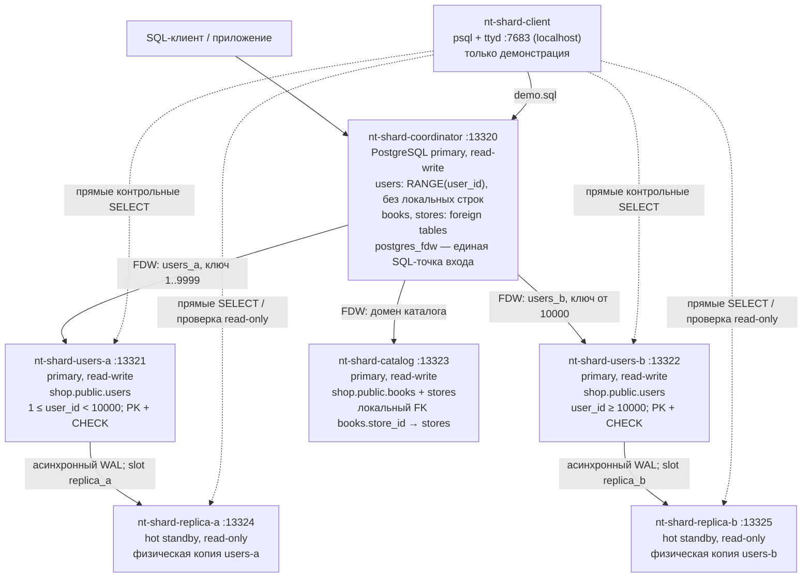

```mermaid
flowchart TB
    app["SQL-клиент / приложение"]
    client["nt-shard-client<br/>psql + ttyd :7683 (localhost)<br/>только демонстрация"]
    c["nt-shard-coordinator :13320<br/>PostgreSQL primary, read-write<br/>users: RANGE(user_id), без локальных строк<br/>books, stores: foreign tables<br/>postgres_fdw — единая SQL-точка входа"]
    a["nt-shard-users-a :13321<br/>primary, read-write<br/>shop.public.users<br/>1 ≤ user_id &lt; 10000; PK + CHECK"]
    b["nt-shard-users-b :13322<br/>primary, read-write<br/>shop.public.users<br/>user_id ≥ 10000; PK + CHECK"]
    cat["nt-shard-catalog :13323<br/>primary, read-write<br/>shop.public.books + stores<br/>локальный FK books.store_id → stores"]
    ar["nt-shard-replica-a :13324<br/>hot standby, read-only<br/>физическая копия users-a"]
    br["nt-shard-replica-b :13325<br/>hot standby, read-only<br/>физическая копия users-b"]
    app --> c
    client -->|demo.sql| c
    c -->|FDW: users_a, ключ 1..9999| a
    c -->|FDW: users_b, ключ от 10000| b
    c -->|FDW: домен каталога| cat
    a -->|асинхронный WAL; slot replica_a| ar
    b -->|асинхронный WAL; slot replica_b| br
    client -.->|прямые контрольные SELECT| a
    client -.->|прямые контрольные SELECT| b
    client -.->|прямые SELECT / проверка read-only| ar
    client -.->|прямые SELECT / проверка read-only| br
```
